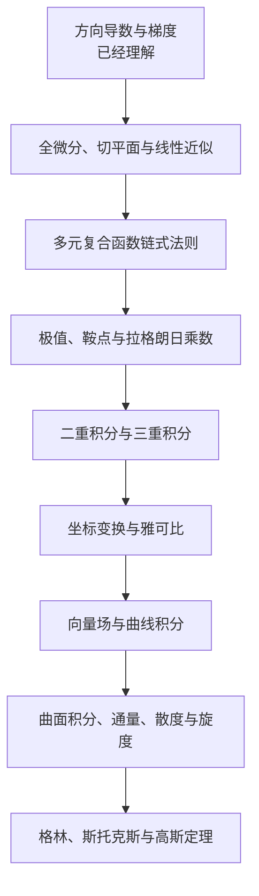

# 方向导数后续学习路径

> [!summary] 当前起点
> 方向导数已经理解。下一步先完成“多元微分”，再学习“多重积分”，最后进入“向量微积分”。

## 总路线

## 第一阶段：把多元微分学完整

### 1. 全微分与线性近似

核心公式：

$$
\boxed{\Delta f\approx f_x\Delta x+f_y\Delta y=\nabla f\cdot\Delta\mathbf r}
$$

要理解：方向导数给出一个单位方向的变化率；全微分直接估算任意小位移造成的函数变化量。

### 2. 切平面

要理解：曲面在一个点附近可以用平面近似，全微分就是这个切平面的变化规律。

### 3. 多元复合函数链式法则

核心公式：

$$
\boxed{\frac{df}{dt}=\nabla f\cdot\mathbf r'(t)}
$$

要理解：沿一条随时间变化的路径运动时，函数值怎样变化。

### 4. 极值、鞍点与拉格朗日乘数

先研究无约束极值：

$$
\nabla f=0
$$

再研究带约束的最大值和最小值，即拉格朗日乘数法。

> [!important] 当前最近的一步
> 下一课先学习“全微分、切平面与线性近似”，不要直接跳到积分。

## 第二阶段：从局部变化进入区域累积

### 5. 二重积分

$$
\iint_D f(x,y)\,dA
$$

学习把二维区域内的微小量累加起来，用于计算体积、质量、平均值和概率等。

### 6. 三重积分

$$
\iiint_V f(x,y,z)\,dV
$$

学习把三维空间中的微小体积累加起来。

### 7. 坐标变换与雅可比

依次学习极坐标、柱坐标、球坐标以及雅可比行列式，理解坐标变换时面积和体积为什么会伸缩。

## 第三阶段：向量微积分

### 8. 向量场

$$
\mathbf F(x,y)=(P(x,y),Q(x,y))
$$

理解空间中每一个点都有一个向量；梯度场是向量场的一种。

### 9. 曲线积分

$$
\int_C\mathbf F\cdot d\mathbf r
$$

把沿路径每一点的方向分量累加起来，可用于计算力场做功。

### 10. 曲面积分、通量、散度与旋度

- 通量：有多少向量场穿过一个面；
- 散度 $\nabla\cdot\mathbf F$：某点附近是向外流出还是向内汇入；
- 旋度 $\nabla\times\mathbf F$：某点附近有没有旋转趋势。

### 11. 三大积分定理

依次学习：

1. 格林公式；
2. 斯托克斯公式；
3. 高斯散度定理。

共同思想是：

$$
\boxed{\text{区域内部的总变化}=\text{边界上表现出来的总效果}}
$$

## 学习检查点

- [x] 方向导数与梯度
- [ ] 全微分、切平面与线性近似
- [ ] 多元复合函数链式法则
- [ ] 极值、鞍点与拉格朗日乘数
- [ ] 二重积分与三重积分
- [ ] 坐标变换与雅可比
- [ ] 向量场与曲线积分
- [ ] 曲面积分、通量、散度与旋度
- [ ] 格林、斯托克斯与高斯定理

## 相关资料

- [方向导数最简单总结](方向导数最简单总结.md)
- [OpenStax：多重积分](https://openstax.org/books/calculus-volume-3/pages/5-introduction)
- [OpenStax：向量微积分](https://openstax.org/books/calculus-volume-3/pages/6-introduction)
