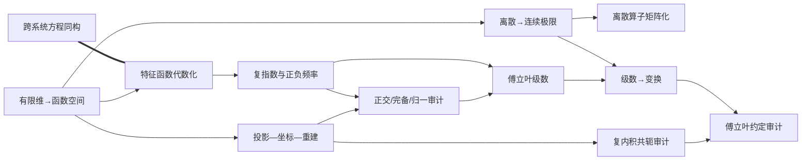

# 傅立叶变换究极入门 — Skill Index

> 本视频由 `cangjie-skill` 蒸馏为 **12 个 skills**，并映射为 12 个三页式离线学习模块。处理时间：2026-08-23。

## 关于来源

- **讲者**：AI Sci Ke 理工柯小西
- **发布时间**：2025-01-23
- **一句话主旨**：傅立叶变换是函数在复指数频率基上的坐标变换——投影得到频谱，线性组合恢复原函数。
- [整片理解](./BOOK_OVERVIEW.md) · [精华长文](./DIGEST.md) · [共享词典](./GLOSSARY.md) · [三重验证](./verified.md)
- [离线学习系统](../../learning-system/index.html)

## Skill 列表

### 坐标与连续化基础

- [`projection-coordinate-reconstruction`](./projection-coordinate-reconstruction/SKILL.md) — 用分析/综合闭环拆解变换。
- [`finite-to-function-space`](./finite-to-function-space/SKILL.md) — 把有限维结构有条件地迁移到函数空间。
- [`discrete-continuous-limit`](./discrete-continuous-limit/SKILL.md) — 从带网格权重的求和走到积分。
- [`complex-inner-product-audit`](./complex-inner-product-audit/SKILL.md) — 按投影/综合角色判断共轭与正负号。

### 算子与复指数

- [`cross-system-equation-isomorphism`](./cross-system-equation-isomorphism/SKILL.md) — 用控制方程结构迁移跨物理系统解法。
- [`discrete-operator-matrix`](./discrete-operator-matrix/SKILL.md) — 以差分和累加矩阵理解连续算子。
- [`eigenfunction-operator-algebra`](./eigenfunction-operator-algebra/SKILL.md) — 用特征函数把微分算子代数化。
- [`complex-exponential-frequency-pair`](./complex-exponential-frequency-pair/SKILL.md) — 解释欧拉公式、正负频率与共轭对称。

### 傅立叶分析

- [`orthogonal-basis-audit`](./orthogonal-basis-audit/SKILL.md) — 分开审计正交、完备和归一。
- [`fourier-series-analysis-synthesis`](./fourier-series-analysis-synthesis/SKILL.md) — 周期函数的系数提取和谐波重建。
- [`series-to-transform-limit`](./series-to-transform-limit/SKILL.md) — 以周期拉伸把离散谱推向连续谱。
- [`fourier-convention-audit`](./fourier-convention-audit/SKILL.md) — 审计 `f/ω`、符号、微元与 `2π` 约定。

## 依赖图

## 推荐顺序

1. 有限维到函数空间 → 投影—坐标—重建
2. 离散到连续 → 连续算子的离散矩阵化
3. 特征函数 → 复指数与正负频率
4. 复内积审计 → 正交/完备/归一审计
5. 傅立叶级数 → 周期拉伸到傅立叶变换
6. 最后用傅立叶约定审计统一不同教材公式

## 审计轨迹

- [90 条五路候选](./candidates/) · [5 个淘汰/降级单元](./rejected/) · [转写稿](../../transcript/gemini-3.7-flash/e2Nd4iStm7s-简体中文逐字稿.md)
- 每个 skill 包含 `SKILL.md`、`test-prompts.json`、独立盲测结果与 `test-results.md`。
